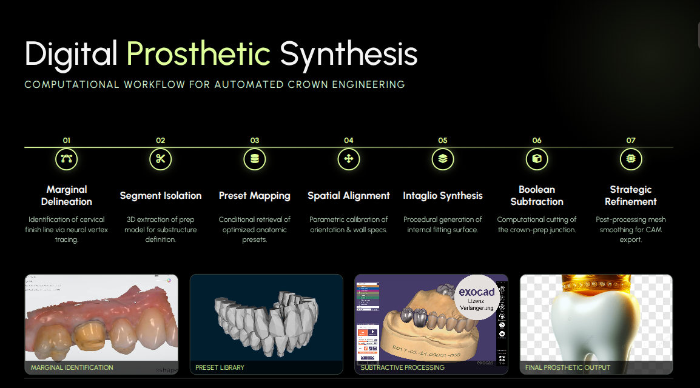

# NuDent

**NuDent** is an automated 3D digital dentistry platform designed for tooth segmentation, prosthetic planning, and CAD workflows. It combines modern computer vision with dental-specific logic to simplify the creation of crowns, dentures, and surgical guides.



## 🚀 Key Features

- **3D AI Segmentation**: Integrated with **Samesh** (SAM 2-based mesh segmentation) to automatically partition jaw scans into individual teeth.
- **Library Mapping**: Comprehensive support for the **FDI (World Dental Federation)** numbering system, with automatic mirroring for bilateral symmetry.
- **Guided Workflows**: A modular pipeline including:
  - **Margin Detection**: Precisely identify preparation margins.
  - **Tooth Placement**: Align library teeth to the patient's anatomy.
  - **Shell & Trim**: Generate final CAD geometries for manufacturing.
- **Interactive UI**: A PyQt5-based desktop interface for real-time visualization and adjustment.

## 🛠 Installation

### Prerequisites
- Python 3.10+
- A high-resolution jaw scan (STL/OBJ format)

### Setup Environment
It is recommended to use a virtual environment:

```bash
python3 -m venv nudent_env
source nudent_env/bin/activate
```

### Install Dependencies
NuDent requires several specialized libraries for 3D processing and AI:

```bash
# 1. Install Core 3D and UI tools
pip install PyQt5 trimesh numpy pyrender scikit-learn

# 2. Install AI dependencies (CPU-optimized version)
pip install torch torchvision --index-url https://download.pytorch.org/whl/cpu

# 3. Setup Samesh (included as a submodule/folder)
cd samesh
pip install -e .
```

## 💻 Usage

To launch the main desktop application:

```bash
python -m app
```

### Segmentation Pipeline
You can also run the segmentation logic independently using the provided notebooks or scripts:

```python
from samesh.models.sam_mesh import segment_mesh
# ... see mesh_samesh.ipynb for examples
```

## 📂 Project Structure

- `app/`: Main PyQt5 application logic and UI stages.
- `samesh/`: Core AI segmentation engine using SAM 2.
- `tooth_placer.py`: Algorithms for automated tooth alignment.
- `Tooth_Library/`: (Optional) Standardized STL geometries for various tooth types.
- `configs/`: YAML configurations for fine-tuning segmentation performance.

## 📄 License

[Insert License Type - e.g., MIT]

---
*Developed for high-precision digital dentistry.*
